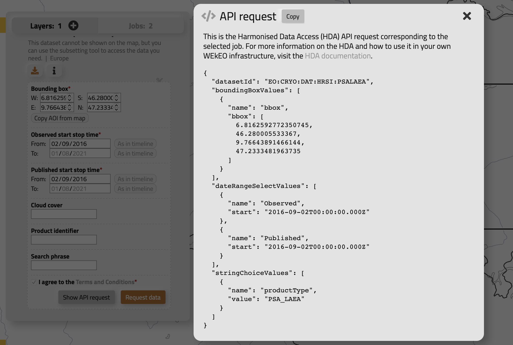
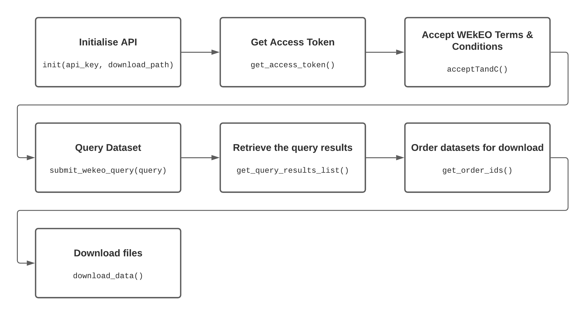

# WEkEOR

The wekeoR package simplifies provides a wrapper for the WEkEO Harmonised Data Access (HDA) API. 

WEkEO is one of several portals which provide access to ESA Copernicus and Sentinal satellite data as well as derived products    . 

More information on [WEkEO can be found here]("https://www.wekeo.eu"). Documentation and more information on the API this package wraps [can be found here]('https://www.wekeo.eu/docs/harmonised-data-access-api#authentication'). 

## Installation
You can install the development version of the package using dev tools.
```r
# install.packages("devtools")
devtools::install_github("wave1art/wekeoR")
```


## Basic Example
```r
library(wekeoR)

hda_list = wekeoR::init(api_key, output_directory)

dataset_id = 'EO:CRYO:DAT:HRSI:FSC'

# Define the query to run on WEkEO API
query = list(datasetId = 'EO:CRYO:DAT:HRSI:FSC',
             boundingBoxValues = list( list(name = 'bbox',
                                            bbox = c( 6.9375502668826,
                                                      46.51799925662627,
                                                      9.453098610481598,
                                                      47.214513711335606))),
             dateRangeSelectValues = list( list( name = 'Observed',
                                                 start = '2021-06-15T23:59:59.999Z',
                                                 end = '2021-07-09T23:59:59.999Z'),
                                           list( name = 'Published',
                                                 start = '2021-06-15T23:59:59.999Z',
                                                 end = '2021-07-09T23:59:59.999Z')),
             stringChoiceValues = list( list( name = 'productType',
                                              value = 'FSC'))
)
  
# Query the WEkEO database
hda_list = hda_list |> get_access_token() |>
  acceptTandC() |>
  submit_wekeo_query(query) |>
  get_query_results_list()

# Download files 
hda_list = hda_list |>  
  get_order_ids() |> 
  download_data(hda_list, 'zip')

```

## Pre-requisites
Before being able to search or download data from the WEkEO API you need to have registered an account. 


## Basic usage flow
1. Find the relevant dataset of interest on WEkEO
2. Query the WEkEO API to determine relevant raster tiles 
3. Order and download the raster tiles


### Use the WEkEO App to find datasets
WEkEO provides a [simple online interface]("https://www.wekeo.eu/data?view=viewer&t=1627776000000&z=0&center=0%2C24.4152&zoom=10.49&initial=1") to browse the dataset catalogue and visualise datasets.

This interface also gives access to the metadata needed to construct a valid query. It can be used to generate a template query which can then be adapted to suit your specific needs.

{width=100%}
Sometimes the query JSON in the WEkEO brower appears to be malformed so it is generally a good idea to test a query through the web interface to check that it is accepted. Already knowing whether there is a problem with the JSON generally accelerates debugging. 

## API flow diagram
{width=100%}


## Dataset queries & troubleshooting
The exact format required of the WEkEO query is given by the dataset metadata. In practice it can be a hassle to create a correctly formatted query object. Often it is faster to use a JSON object created by the WEkEO web interface for the dataset of interest as a starting point. 

The query function `submit_wekeo_query` expects the query argument to be in the form of a nested list. This is converted to a JSON object before submitting to the WEkEO API. 

There are a couple of tricks which can ensure the submitted JSON is as expected by the WEkEO API. 

**Single element lists**  
Because httr auto-unboxes lists before converting to JSON this can result in a JSON object which WEkEO rejects for single item lists. In the example below unboxing creates a JSON dictionary where WEkEO was exepting an array of dictionaries. As a result the query will fail.
```r
# Fails: argument gets unboxed and WEkEO rejects the query
query = list(  ...
              
               stringChoiceValues = list( name = 'productType',
                                              value = 'FSC')
              ....
              )

 JSON:
   {....
  "name":["productType"],"value":["FSC"]  <-- This should be an array
  ....
  } 
```

The trick is to wrap these single item lists in a list. The output is then a dictionary inside an array, which is the format WEkEO was expecting.
```r
# Succeeds: wrapping in an extra list ensures httr submits this as a single element JSON array
query = list(  ...
              
               stringChoiceValues = list( list( name = 'productType',
                                              value = 'FSC'))
              ....
              )
 
JSON:
  { ...
    [{"name":["productType"],"value":["FSC"]}]  <-- now part of an array as required
    ...
  }
```

